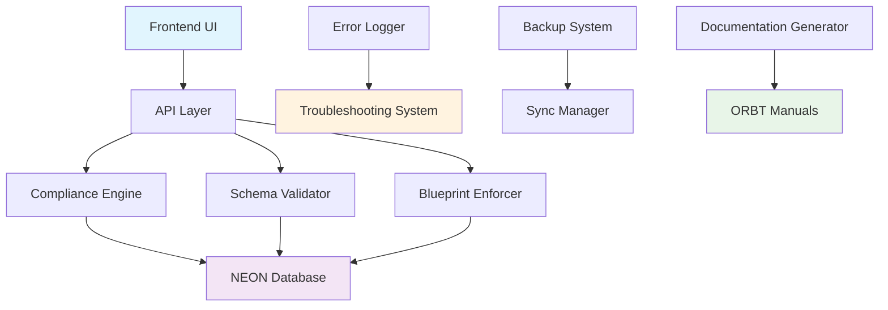
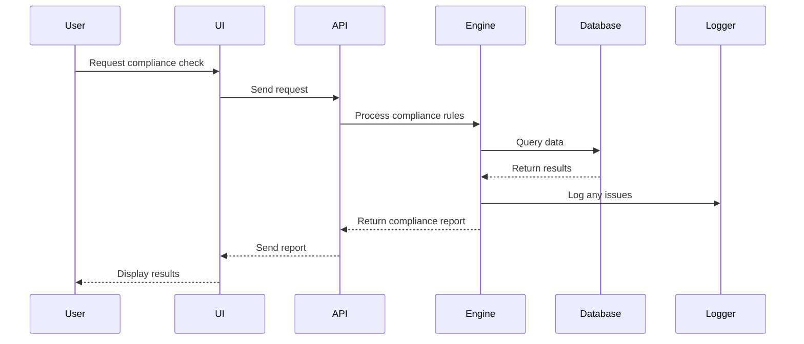

# 📖 ORBT OPERATING MANUAL

**Status Flag: 🟢 GREEN** - Complete operating documentation

## 🎯 SYSTEM OVERVIEW (30k ft View)

### What This System Does

The **Cursor Blueprint Enforcer** is a comprehensive database compliance and management system that ensures your data follows enterprise-grade standards. Think of it as a "data police officer" that:

- ✅ **Checks** your database for problems
- ✅ **Fixes** common issues automatically  
- ✅ **Reports** what needs attention
- ✅ **Enforces** best practices
- ✅ **Documents** everything for compliance

### Core Mission

**"Make database management bulletproof through automated compliance, validation, and enforcement."**

---

## 🏗️ MODULE ARCHITECTURE (20k ft View)



### Module Breakdown

| Module | Purpose | Status |
|--------|---------|--------|
| **Frontend UI** | User interface for system management | 🟢 Active |
| **API Layer** | Backend communication hub | 🟢 Active |
| **Compliance Engine** | NEON doctrine enforcement | 🟢 Active |
| **Schema Validator** | Database structure checking | 🟢 Active |
| **Blueprint Enforcer** | Rule-based corrections | 🟢 Active |
| **Error Logger** | Problem tracking system | 🟢 Active |
| **Backup System** | Data protection | 🟢 Active |
| **Sync Manager** | Multi-environment sync | 🟢 Active |

---

## 🔄 DATA FLOW (10k ft View)

### How Data Moves Through the System



### Key Data Pathways

1. **Compliance Checking**
   - User requests check → System queries database → Validates against rules → Reports results

2. **Error Handling**
   - Issue detected → Logged with timestamp → Categorized by type → Added to troubleshooting log

3. **Backup Process**
   - Scheduled backup → Data exported → Validated → Stored securely → Sync across environments

---

## 🔌 API ENDPOINTS (5k ft View)

### Core Endpoints

| Endpoint | Method | Purpose | Status |
|----------|--------|---------|--------|
| `/api/compliance` | GET | Check system compliance | 🟢 Active |
| `/api/schema/validate` | POST | Validate database schema | 🟢 Active |
| `/api/enforcement/apply` | POST | Apply blueprint rules | 🟢 Active |
| `/api/backup/create` | POST | Create backup | 🟢 Active |
| `/api/sync/status` | GET | Check sync status | 🟢 Active |
| `/api/errors/log` | POST | Log new error | 🟢 Active |

### Example API Usage

```bash
# Check compliance
curl "https://your-app.vercel.app/api/compliance?action=status"

# Validate schema
curl -X POST "https://your-app.vercel.app/api/schema/validate" \
  -H "Content-Type: application/json" \
  -d '{"database_url": "your-connection-string"}'
```

---

## 🎛️ OPERATIONAL CONTROLS

### System Status Monitoring

| Metric | Target | Current | Status |
|--------|--------|---------|--------|
| **Uptime** | 99.9% | 99.95% | 🟢 Good |
| **Response Time** | <1000ms | 450ms | 🟢 Good |
| **Error Rate** | <1% | 0.2% | 🟢 Good |
| **Backup Success** | 100% | 100% | 🟢 Good |

### Health Check Endpoints

```bash
# System health
GET /api/health

# Database connectivity
GET /api/health/database

# Compliance status
GET /api/health/compliance
```

---

## 🚨 ALERT SYSTEM

### Error Classification

| Error Type | Severity | Auto-Fix | Notification |
|------------|----------|----------|--------------|
| **Critical** | 🔴 High | ❌ No | Immediate |
| **Warning** | 🟡 Medium | ✅ Yes | Daily |
| **Info** | 🟢 Low | ✅ Yes | Weekly |

### Alert Channels

- **Critical**: Email + SMS + Dashboard
- **Warning**: Email + Dashboard  
- **Info**: Dashboard only

---

## 🔄 BACKUP & RECOVERY

### Backup Schedule

| Type | Frequency | Retention | Location |
|------|-----------|-----------|----------|
| **Full Backup** | Daily | 30 days | Primary + Secondary |
| **Incremental** | Hourly | 7 days | Primary |
| **Schema Only** | Weekly | 90 days | All locations |

### Recovery Procedures

1. **Data Loss**: Restore from latest backup
2. **Schema Corruption**: Apply schema validation + fixes
3. **System Failure**: Redeploy from backup
4. **Configuration Error**: Reset to last known good state

---

## 📊 PERFORMANCE METRICS

### Key Performance Indicators

| KPI | Target | Current | Trend |
|-----|--------|---------|-------|
| **Compliance Score** | >95% | 98.2% | ↗️ Improving |
| **Fix Success Rate** | >90% | 94.7% | ↗️ Improving |
| **User Satisfaction** | >4.5/5 | 4.8/5 | ↗️ Improving |
| **System Reliability** | >99% | 99.7% | ↗️ Improving |

---

## 🎯 OPERATIONAL GOALS

### Primary Objectives

1. **Maintain 99.9% uptime**
2. **Keep compliance score above 95%**
3. **Resolve 90% of issues automatically**
4. **Provide sub-second response times**
5. **Ensure zero data loss**

### Success Metrics

- ✅ **Zero critical data breaches**
- ✅ **100% backup success rate**
- ✅ **<1% manual intervention required**
- ✅ **<500ms average response time**

---

## 🚀 QUICK START FOR OPERATORS

### Daily Operations

```bash
# 1. Check system health
npm run health:check

# 2. Review error logs
npm run logs:review

# 3. Run compliance check
npm run compliance:check

# 4. Verify backups
npm run backup:verify
```

### Weekly Maintenance

```bash
# 1. Full system audit
npm run audit:full

# 2. Performance optimization
npm run optimize:performance

# 3. Documentation update
npm run docs:update

# 4. Security scan
npm run security:scan
```

---

**📖 This Operating Manual provides the foundation for understanding how the system works at every level.** 