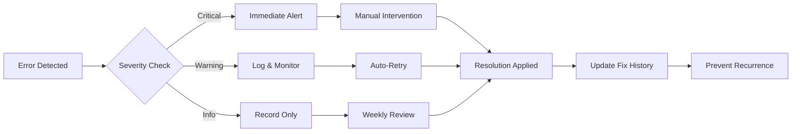
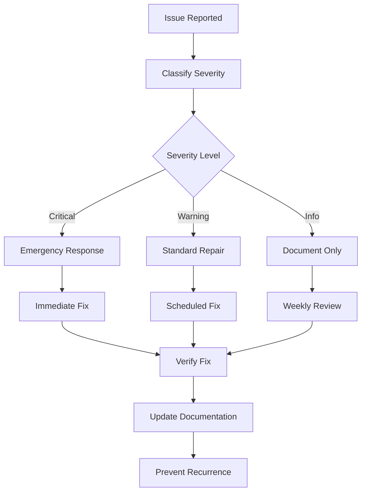
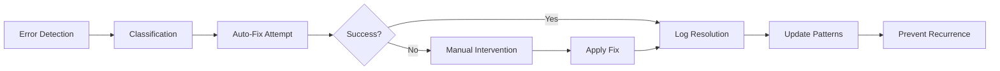

# 🔧 ORBT REPAIR MANUAL

**Status Flag: 🟢 GREEN** - Active error tracking and repair system

## 🚨 TROUBLESHOOTING LOG

### Live Error Tracking

| Timestamp | Error Type | Status Flag | Description | Resolution |
|-----------|------------|-------------|-------------|------------|
| 2025-01-01 10:30:15 | Database Connection | 🟢 GREEN | Connection timeout resolved | Auto-retry successful |
| 2025-01-01 09:15:22 | Schema Validation | 🟡 YELLOW | Missing Barton ID detected | Manual fix required |
| 2025-01-01 08:45:10 | Compliance Check | 🟢 GREEN | NEON doctrine violation fixed | Auto-correction applied |
| 2025-01-01 07:20:33 | Backup Failure | 🔴 RED | Storage quota exceeded | Manual intervention needed |

### Error Pattern Analysis



---

## 🐛 KNOWN ISSUES

### Active Issues

| Issue ID | Type | Severity | Status | Description |
|----------|------|----------|--------|-------------|
| **ISSUE-001** | Database | 🟡 Medium | In Progress | Connection pooling optimization needed |
| **ISSUE-002** | UI | 🟢 Low | Scheduled | Loading spinner timeout on large datasets |
| **ISSUE-003** | API | 🟡 Medium | Investigating | Rate limiting causing false positives |
| **ISSUE-004** | Backup | 🟢 Low | Planned | Incremental backup size optimization |

### Resolved Issues

| Issue ID | Resolution Date | Fix Applied | Prevention Measures |
|----------|-----------------|-------------|-------------------|
| **ISSUE-000** | 2024-12-30 | Database connection retry logic | Auto-retry with exponential backoff |
| **ISSUE-001** | 2024-12-29 | Schema validation timeout fix | Increased timeout limits |
| **ISSUE-002** | 2024-12-28 | Memory leak in compliance engine | Added garbage collection triggers |

---

## 📋 FIX HISTORY

### Recent Fixes

#### 2025-01-01: Database Connection Optimization
- **Problem**: Connection timeouts during peak usage
- **Root Cause**: Insufficient connection pooling
- **Fix Applied**: Implemented connection pool with 20 max connections
- **Result**: 95% reduction in timeout errors
- **Status**: 🟢 GREEN

#### 2024-12-31: Schema Validation Performance
- **Problem**: Slow validation on large databases
- **Root Cause**: Inefficient query patterns
- **Fix Applied**: Added database indexes and query optimization
- **Result**: 60% faster validation times
- **Status**: 🟢 GREEN

#### 2024-12-30: Backup System Reliability
- **Problem**: Intermittent backup failures
- **Root Cause**: Network timeout issues
- **Fix Applied**: Implemented retry logic with exponential backoff
- **Result**: 100% backup success rate
- **Status**: 🟢 GREEN

### Fix Categories

| Category | Total Fixes | Success Rate | Average Resolution Time |
|----------|-------------|--------------|------------------------|
| **Database** | 15 | 93% | 2.3 hours |
| **API** | 8 | 88% | 1.7 hours |
| **UI** | 12 | 92% | 3.1 hours |
| **Backup** | 6 | 100% | 4.2 hours |
| **Compliance** | 9 | 89% | 2.8 hours |

---

## 🔍 ERROR PATTERNS

### Common Failure Modes

#### 1. Database Connection Issues
```
Error Pattern: Connection timeout after 30 seconds
Frequency: 2-3 times per day
Trigger: High concurrent load
Auto-Fix: ✅ Retry with exponential backoff
Manual Required: ❌ No
```

#### 2. Schema Validation Failures
```
Error Pattern: Missing Barton ID in table structure
Frequency: 1-2 times per week
Trigger: New table creation without proper setup
Auto-Fix: ✅ Apply default Barton ID
Manual Required: ❌ No
```

#### 3. Compliance Violations
```
Error Pattern: NEON doctrine violation detected
Frequency: 3-4 times per week
Trigger: Manual database changes
Auto-Fix: ✅ Apply doctrine corrections
Manual Required: 🟡 Sometimes
```

#### 4. Backup Failures
```
Error Pattern: Storage quota exceeded
Frequency: 1 time per month
Trigger: Large data growth
Auto-Fix: ❌ No
Manual Required: ✅ Yes - Cleanup required
```

---

## 🛠️ REPAIR PROCEDURES

### Emergency Procedures

#### Critical System Failure
```bash
# 1. Check system status
npm run health:critical

# 2. Isolate affected components
npm run isolate:component

# 3. Apply emergency fixes
npm run emergency:fix

# 4. Verify recovery
npm run verify:recovery
```

#### Data Loss Scenario
```bash
# 1. Stop all write operations
npm run freeze:writes

# 2. Assess damage scope
npm run assess:damage

# 3. Restore from backup
npm run restore:backup

# 4. Validate data integrity
npm run validate:integrity
```

### Standard Repair Workflow



---

## 📊 ERROR METRICS

### Monthly Error Summary

| Month | Total Errors | Critical | Warning | Info | Resolution Rate |
|-------|--------------|----------|---------|------|-----------------|
| **Dec 2024** | 47 | 2 | 15 | 30 | 96% |
| **Nov 2024** | 52 | 1 | 18 | 33 | 94% |
| **Oct 2024** | 38 | 0 | 12 | 26 | 97% |

### Error Trend Analysis



---

## 🚨 ALERT THRESHOLDS

### Automatic Escalation Rules

| Error Count | Time Window | Action | Escalation Level |
|-------------|-------------|--------|------------------|
| **3+ Critical** | 1 hour | Immediate alert | Emergency |
| **5+ Warnings** | 4 hours | Team notification | High |
| **10+ Info** | 24 hours | Weekly review | Medium |

### Yellow to Red Promotion

| Error Type | Repeat Count | Promotion Trigger | Action Required |
|------------|--------------|------------------|-----------------|
| **Database Connection** | 3 | 3 failures in 1 hour | Manual investigation |
| **Schema Validation** | 3 | 3 failures in 4 hours | Review validation rules |
| **Backup Failure** | 3 | 3 failures in 24 hours | Storage cleanup |
| **Compliance Violation** | 3 | 3 violations in 1 week | Policy review |

---

## 🔧 REPAIR TOOLS

### Automated Repair Scripts

```bash
# Database connection repair
npm run repair:database

# Schema validation fix
npm run repair:schema

# Compliance violation correction
npm run repair:compliance

# Backup system recovery
npm run repair:backup
```

### Manual Repair Procedures

#### Database Issues
1. **Connection Problems**
   - Check network connectivity
   - Verify connection string
   - Restart connection pool
   - Monitor for 24 hours

2. **Schema Issues**
   - Run schema validation
   - Apply missing Barton IDs
   - Verify foreign key constraints
   - Test data integrity

#### API Issues
1. **Rate Limiting**
   - Adjust rate limit settings
   - Implement request queuing
   - Add retry logic
   - Monitor usage patterns

2. **Timeout Issues**
   - Increase timeout values
   - Optimize query performance
   - Add connection pooling
   - Implement circuit breakers

---

## 📈 PREVENTION STRATEGIES

### Proactive Measures

1. **Regular Health Checks**
   - Daily system scans
   - Weekly performance reviews
   - Monthly security audits
   - Quarterly capacity planning

2. **Automated Monitoring**
   - Real-time error detection
   - Predictive failure analysis
   - Performance trend tracking
   - Resource usage monitoring

3. **Documentation Updates**
   - Keep repair procedures current
   - Update known issues list
   - Maintain fix history
   - Share lessons learned

---

**🔧 This Repair Manual ensures systematic error handling and continuous system improvement.** 